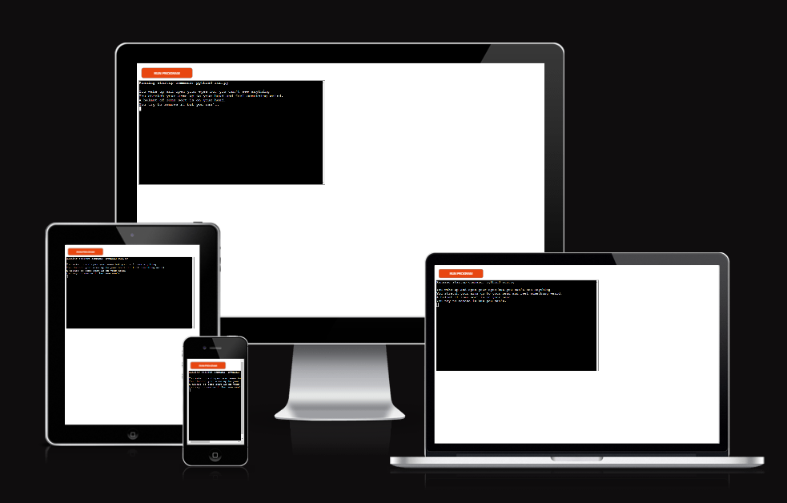
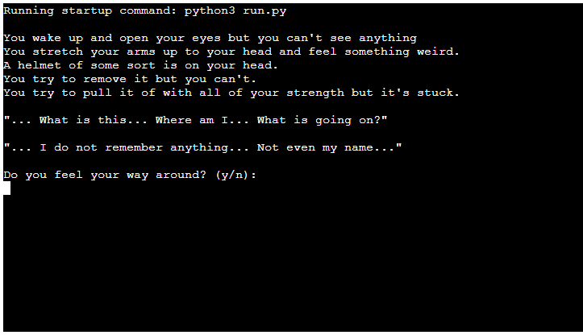
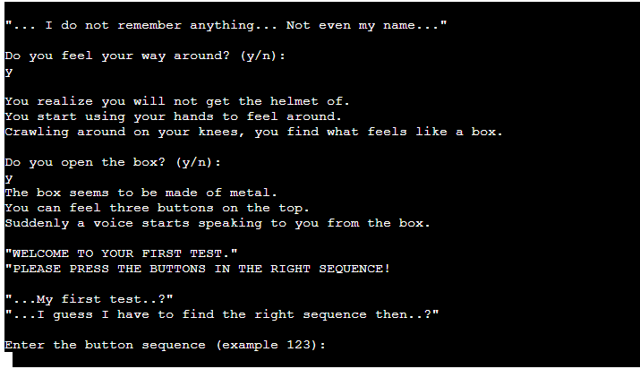

# The mysterious room
The mysterious room is a text-adventure game which uses a lot of guessing games and some riddles. 
It's an exciting game that you can play to challenge your self and see if you can make it to the end of the game!

)

## Features
 ### Existing features
* App
  *  The game is run in a mock terminal and is presented as an app on the heroku website.
  
  

* Input
  * The player is throughout the game promted to provide input. 
  * The input provided leads the player through different rooms and choices. Depending on what the player chooses the story will end differently.
   

  

  ### Features left to implement
  * When there is time I would like to add more rooms and a deeper story. 
  * I would also like to implement more try and except statements to make sure the game won't crash in case something I haven't thought of occures. At this point most of the choices are based on only if else statements which might become a problem in case bugs occure. 

  ## Testing
   * Í have checked the code through the pep8 linter and it gets 7 warnings for too long lines.
        These lines are lines with long comparative expressions.
   * I have done manual testing for bugs. 
   * Tested in my local terminal and the Heroku terminal.
     

### Bugs 
  #### Solved bugs
   * I came across bugs where peices of text kept repeating through out the story. This was beacause I hadn't used break during a while loop. 
   #### Remaining bugs
   * No known remaining bugs. 

### Validator testing
   * PEP8
     * Seven warnings for too long lines.  

## Deployment
   * This project was deployed using Code institutes mock terminal for Heroku.
   * The steps for deployment are as follows.
      * Fork or clone this repository.
      * Create a new Heroku app.
      * Set the build packs to Python and NodeJS in that order.
      * Link the Heroku App to the repository.
      * Click on deploy.

## Credits
   * Code Institute for the deployment terminal.

